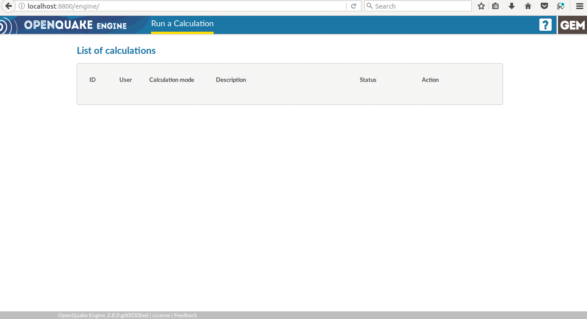
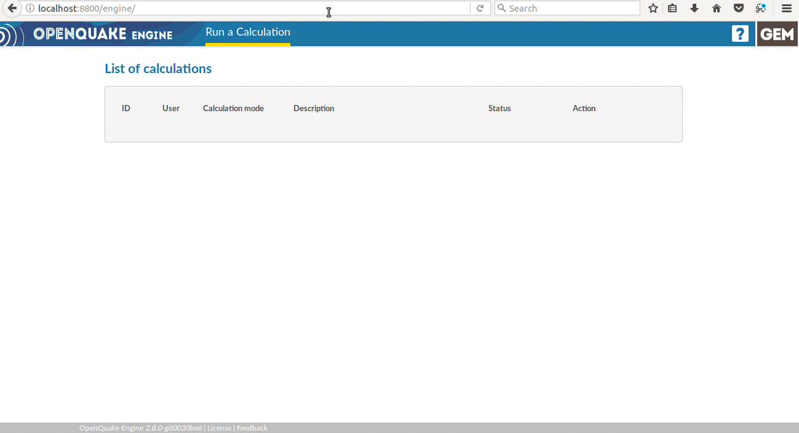
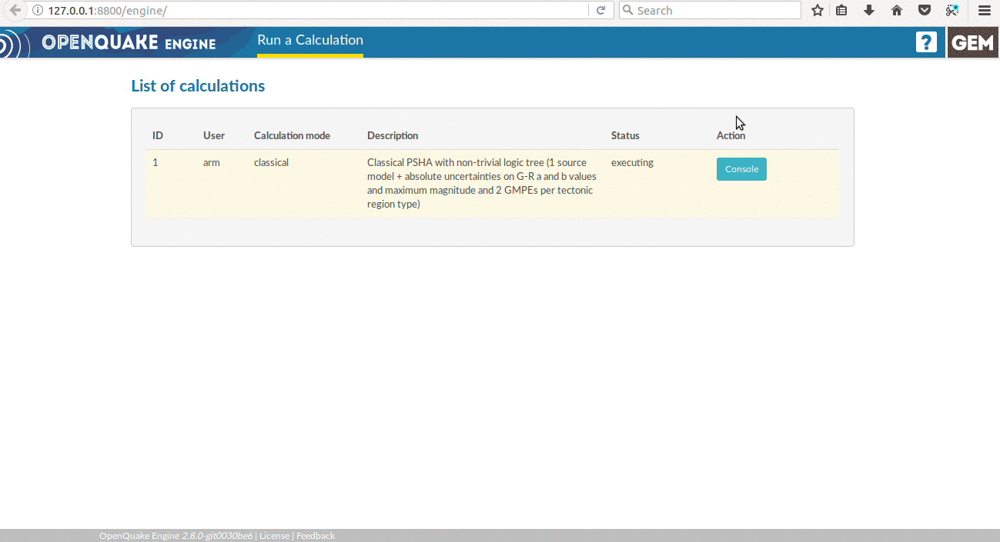
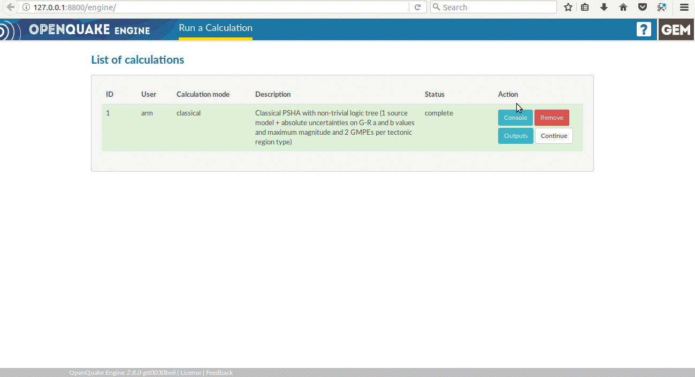
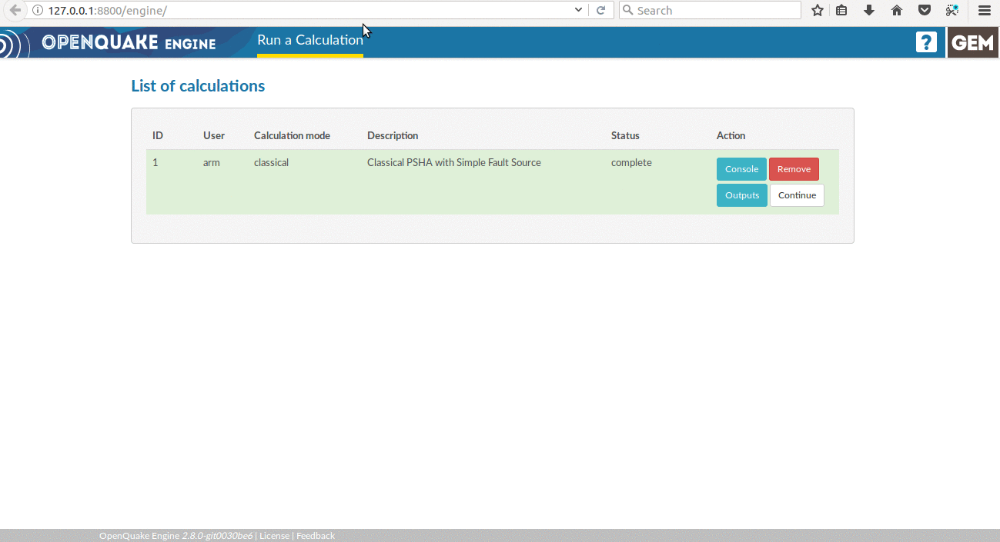
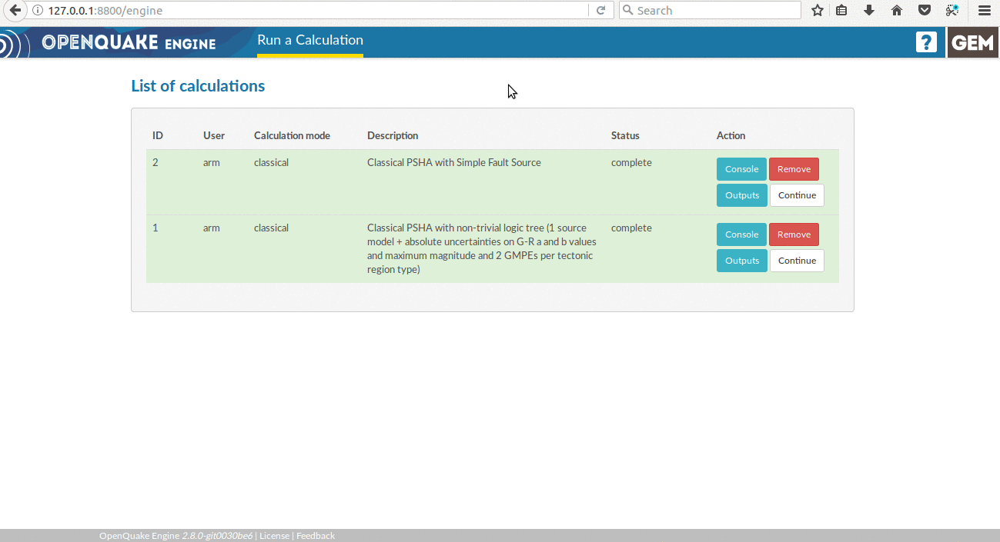
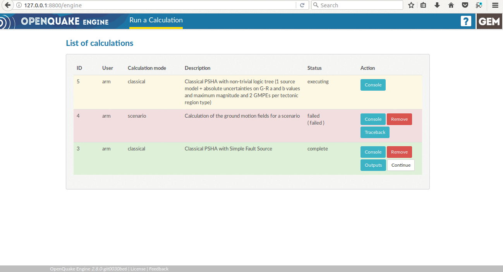

# The OpenQuake Engine server and WebUI

The OpenQuake Engine Server provides an [HTTP RESTful API](https://en.wikipedia.org/wiki/Representational_state_transfer) and a web GUI, the *WebUI*. It's built on top of [Django](https://www.djangoproject.com/), [jQuery](https://jquery.com/) and [BACKBONE.js](http://backbonejs.org/).

The OpenQuake Engine Server is used to submit new jobs, watch calculation progress, retrieve results and more.

The [API document](../web-api.md) provides the full list of available endpoints. Several authentication mechanisms are supported and can be enabled with a [custom configuration](../installing/server.md).

The OpenQuake Engine WebUI does not require any special software on the client side except for a browser. Supported browsers are:

- Mozilla Firefox >= 38
- Google Chrome
- Microsoft Internet Explorer >= 10
- Microsoft Edge
- Apple Safari >= 6

## Using the OpenQuake Engine WebUI

Open the browser and load the [http://localhost:8800/engine](http://localhost:8800/engine) page

### Start a calculation

Before starting a new calculation you need to prepare inputs. All the inputs file and the `job.ini` must be placed in a compressed zip file.

To start a calculation, having the input zip file, select the `Run a Calculation` button in the header menu. A dialog window will appear: select the zip file to be uploaded and press `Open` to confirm

Each running calculation can be stopped with the `Abort` button; this  will interrupt the calculation immediately and revoke any pending task for that specific job.
Note: only a calculation started from the WebUI can be stopped via the `Abort` button; to stop a calculation started by the command line interface the `oq abort` command must be used instead.

### Watch the console log

It is possible to watch the log from a running calculation

The log from a previous run can be also inspected.

### Download outputs

If a calculation has run successfully an `Outputs` button is provided. Click the `Outputs` button to see the list of outputs available for the specific calculation type.
Output availability depends on the type of artifacts generated by the calculation. The possible formats are `xml`, `csv`, `npz`, `zip`. Click on the desired output/format to download the corresponding file

### Run a postprocessing (or risk) calculation on top of a previously computed hazard

To run a postprocessing or risk calculation on top of a previous hazard one you have to click the `Continue` button on the corresponding hazard calculation and select the zip file containing the `job.ini` and the related inputs

### Remove a calculation

To hide a calculation from the list press the `Remove` button

The calculation is removed from the calculations list, but it is not actually removed from the database nor from the datastore.

### Calculation status

A calculation can be in one of the following statuses: `created`, `executing`, `complete`, `failed`

The reason behind a `failed` calculation can be inspected by using the `Traceback` button.

## Getting help
If you need help or have questions/comments/feedback for us, you can:
  * Subscribe to the OpenQuake users mailing list: https://groups.google.com/forum/?fromgroups#!forum/openquake-users
  * Contact us on IRC: irc.freenode.net, channel #openquake
